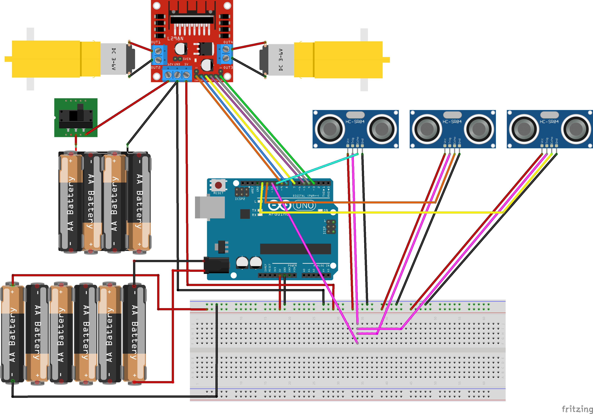

# robot-car: Arduino-Powered Robotic Car 🤖

## Overview
This project demonstrates how to build a two-wheeled robotic car using an Arduino. The robot navigates autonomously by detecting and avoiding obstacles, using distance measurements from ultrasonic sensors.

## Components
### Hardware
- **Arduino UNO**
- **HC-SR04 Ultrasonic Sensors** (x3)
- **Motors** (x2)
  - Typically included in kits with wheels, chassis, power button and a 4-slot battery holder.
- **L298N Motor Driver**
- **Power Supply**
  - 4-slot battery holder (for the L298N motor driver)
  - 6-slot battery holder (for the Arduino)

### Software
- PlatformIO

## Wiring Setup

### Ultrasonic Sensors
  - Trigger Pin:
    - All three sensors share the same trigger pin, connected to **pin 11** on the Arduino via a small breadboard.
  - Echo Pins:
    - Front sensor: Connected to **pin 10**
    - Left sensor: Connected to **pin 13**
    - Right sensor: Connected to **pin 12**

### Motors and L298N Motor Driver
  - Left motor: Connected to the L298N motor driver's **OUT1** and **OUT2**.
  - Right motor: Connected to the L298N motor driver's **OUT3** and **OUT4**.
  - Arduino Connections:
    - Left motor: Connected **ENA**, **IN1** and **IN2** to **pins 9, 8 and 7**, respectively.
    - Right motor: Connected **IN3**, **IN4** and **ENB** to **pins 5, 4 and 3**, respectively.

## Usage
1. Build and Upload:
   - Compile and upload the code to the Arduino using **PlatformIO**.
2. Power On:
   - Connect the **6-slot battery holder** (with batteries) to the Arduino.
   - Connect the **4-slot battery holder** (with batteries) to the L298N motor driver.
   - Turn on the L298N motor driver's power using its power button.
3. The robot will autonomously navigate and avoid obstacles. 🥳
